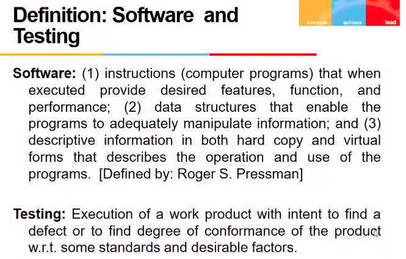
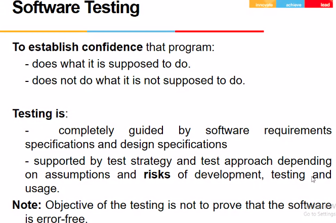
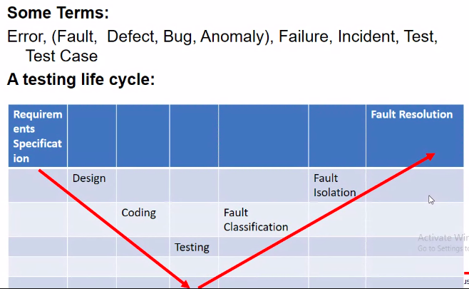
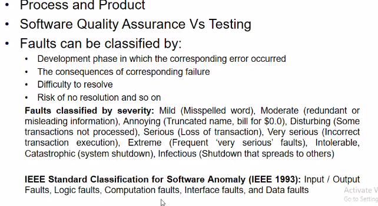
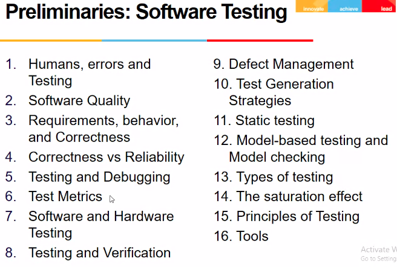
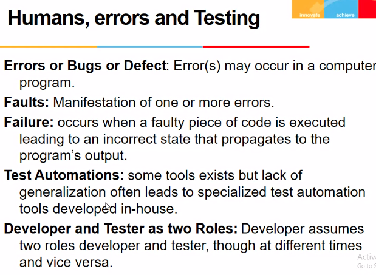

# Lecture 2

## Software and Testing

Testing means exevcute the product and try to find defect

## Software Testing

- obj of testing is not that it is error free but that it does what it is supposed to do, and does not what it is not supposed to do

## Fault Taxonomies

## Preliminaries

## Humans , Errors and Testing

